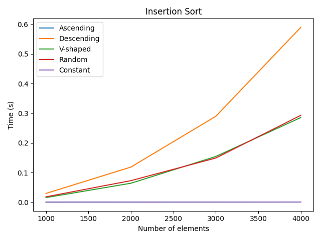
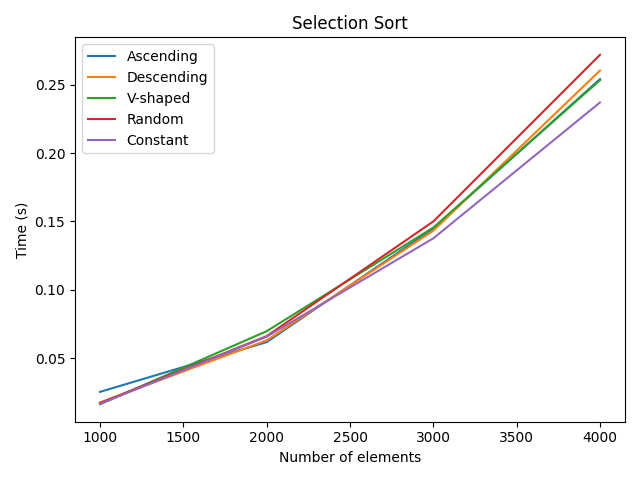
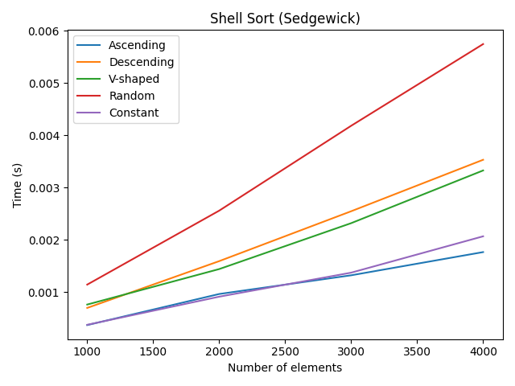
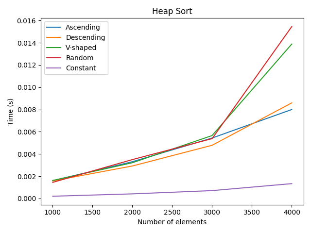
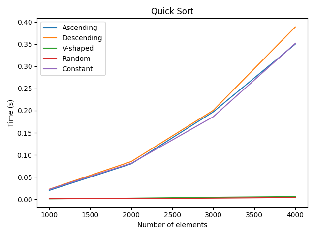
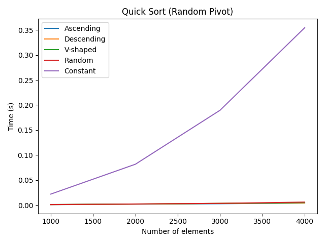

# Sorting Algorithms Visualizer


This project benchmarks and visualizes the performance of various sorting algorithms on different types of input data. It generates plots comparing the execution times of each algorithm for datasets of varying sizes and characteristics.

## Features

- Implements and compares the following sorting algorithms:
  - Insertion Sort
  - Selection Sort
  - Shell Sort (Sedgewick gaps)
  - Heap Sort
  - Quick Sort
  - Quick Sort (Random Pivot)
- Tests sorting on different data distributions:
  - Ascending
  - Descending
  - V-shaped (odd ascending, even descending)
  - Random
  - Constant
- Generates and saves performance plots for each algorithm.

## Example Plots

| Insertion Sort | Selection Sort | Shell Sort (Sedgewick) |
|:--------------:|:--------------:|:----------------------:|
|  |  |  |

| Heap Sort | Quick Sort | Quick Sort (Random Pivot) |
|:---------:|:----------:|:------------------------:|
|  |  |  |

## How to Run

1. **Install dependencies**  
   Make sure you have Python 3 and `matplotlib` installed:
   ```sh
   pip install matplotlib
   ```

2. **Run the main script**  
   Execute the following command in your terminal:
   ```sh
   python main.py
   ```

3. **View the results**  
   The generated plots will be saved in the `plots_png` directory.

## Technologies Used
- Python 3
- Matplotlib for plotting

## License

This project is licensed under the [MIT License](LICENSE).